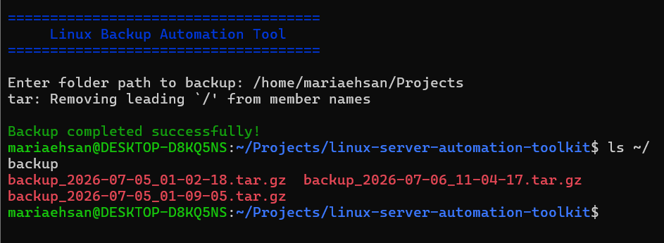

# Linux Server Automation Toolkit

## 📌 Project Overview

This project contains Bash scripts that automate common Linux server administration tasks. It is designed to demonstrate Linux, Bash scripting, Git, and DevOps fundamentals.

## Features

- ✅ Backup Automation
- ✅ Disk Usage Monitoring
- ✅ System Monitoring
- ✅ Log Cleanup
- ✅ User Management

## Technologies Used

- Linux (Ubuntu)
- Bash Shell Scripting
- Git
- GitHub

## Project Structure

```
linux-server-automation-toolkit/
│
├── scripts/
│   ├── backup.sh
│   ├── disk_usage.sh
│   ├── system_monitor.sh
│   ├── log_cleanup.sh
│   └── user_management.sh
│
├── screenshots/
├── docs/
├── README.md
└── .gitignore
```

## How to Run

Make the script executable:

```bash
chmod +x scripts/backup.sh
```

Run the script:

```bash
./scripts/backup.sh
```

## Current Status

- ✅ Backup Automation Script Completed
- 🔄 Disk Usage Script In Progress
- ⏳ System Monitor Script
- ⏳ Log Cleanup Script
- ⏳ User Management Script

## Author

**Maria Ehsan**

Aspiring DevOps Engineer | Linux | Git | Bash | Docker | AWS    

## 📷 Project Screenshot

This screenshot shows the successful execution of the Linux Backup Automation Tool.

